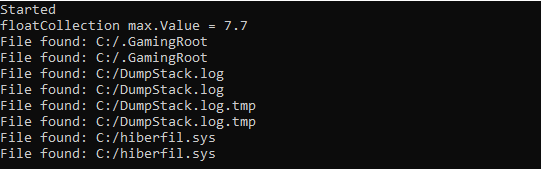

## Работа с методами как с переменными (delegates, events)
###### Вебинар от 26.09.23

### Домашнее задание
Работа с методами как с переменными (delegates, events)

**Цель**:  
В этом задании требуется реализовать механизмы делегатов и событий для получения практического навыка их применения

**Описание/Пошаговая инструкция выполнения домашнего задания**:  
1. Написать обобщённую функцию расширения, находящую и возвращающую максимальный элемент коллекции.
Функция должна принимать на вход делегат, преобразующий входной тип в число для возможности поиска максимального значения.
public static T GetMax(this IEnumerable collection, Func<T, float> convertToNumber) where T : class;
2. Написать класс, обходящий каталог файлов и выдающий событие при нахождении каждого файла;
3. Оформить событие и его аргументы с использованием .NET соглашений:
public event EventHandler FileFound;
FileArgs – будет содержать имя файла и наследоваться от EventArgs
4. Добавить возможность отмены дальнейшего поиска из обработчика;
5. Вывести в консоль сообщения, возникающие при срабатывании событий и результат поиска максимального элемента.

### Инструкция запуска

1. Склонируйте приложение и зайдите в проект:  
   `git clone https://github.com/antoha-p/otus-hw6-26.09.23.git && cd otus-hw6-26.09.23`
2. Откройте решение и запустите проект:

